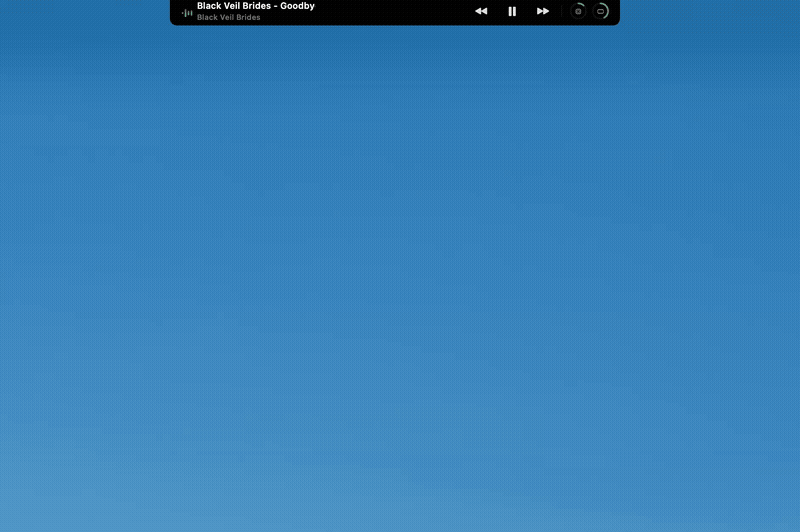

# Notchbar

A macOS app that transforms your MacBook's notch into a powerful command center. Hover over the notch to reveal a floating terminal panel with Claude Code, media controls, system monitoring, file shelf, and clipboard history — all in one place.

> Fork of [adamlyttleapps/notchy](https://github.com/adamlyttleapps/notchy) with additional features and improvements.




## Features

- **Notch integration** — hover over the MacBook notch to reveal the terminal panel, or click the menu bar icon
- **Claude Code terminal** — embedded terminal sessions that auto-detect open Xcode projects and launch Claude
- **Now Playing** — YouTube/Safari media controls with scrolling marquee text for long titles
- **System monitor** — CPU and RAM gauges shown on hover with live percentage values
- **File Shelf** — drag files onto the notch to store them temporarily; drag them back out wherever you need them
- **Clipboard history** — keeps track of recent clipboard entries
- **Git checkpoints** — Cmd+S to snapshot your project before Claude makes changes
- **Multi-session tabs** — run multiple Claude Code sessions side by side
- **Auto-launch** — starts automatically when you log in


## Requirements

- macOS 15.0+ (Sequoia)
- MacBook with a notch (menu bar still works without one)

## Building

Open `Notchy.xcodeproj` in Xcode and build (Cmd+B), or from the command line:

```bash
xcodebuild -project Notchy.xcodeproj -scheme Notchy -configuration Debug build
```

## Dependencies

- [SwiftTerm](https://github.com/migueldeicaza/SwiftTerm) — terminal emulator view (via Swift Package Manager)

## Changes from upstream

- Removed volume control (system volume slider)
- Added scrolling marquee text for long track titles
- System monitor (CPU/RAM) only visible on hover when no media is playing
- CPU/RAM gauges show percentage values on hover
- File shelf supports drag-out (not just drag-in)
- Auto-launch on login via SMAppService
- Fixed timer memory leaks
- More compact notch layout

## License

[MIT](LICENSE)
